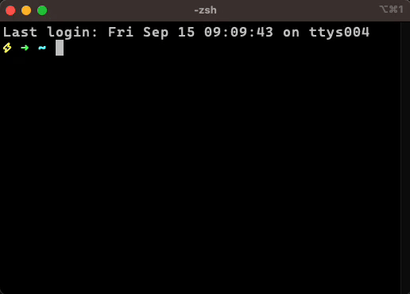

# simple-select

A tool to create simple select functionality in bash scripts.

You provide an array of strings and select one from the shown list with the keyboard.
On Enter the selected index will be output.



## Install

Using the [Homebrew](https://brew.sh/) package manager.

```sh
brew tap frixxx/tap
brew install simple-select
```

## Usage

```zsh
arr=( "a" "b" "c" )

simple-select "${arr[@]}"

echo "${arr[@]:$?:1}"
```
> **ATTENTION:** Use `${arr[@]:$?:1}` to interoperate between bash and zsh shells.
> Please do not use something in the style of `${arr[$i]}` because you might get the wrong values!
> ZSH and Bash start at a different index in arrays

## License
[](https://opensource.org/licenses/MIT)  
